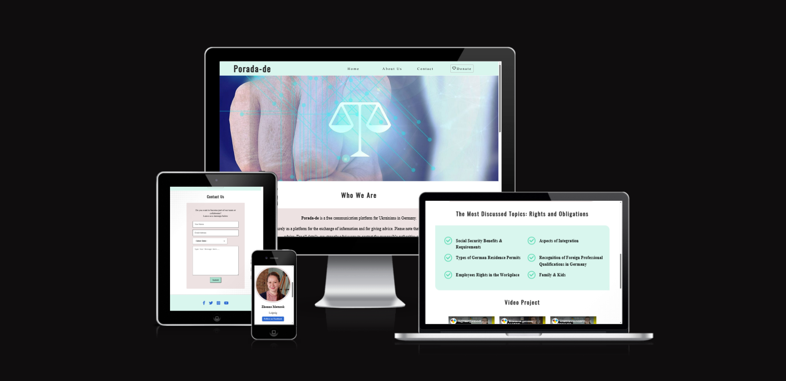
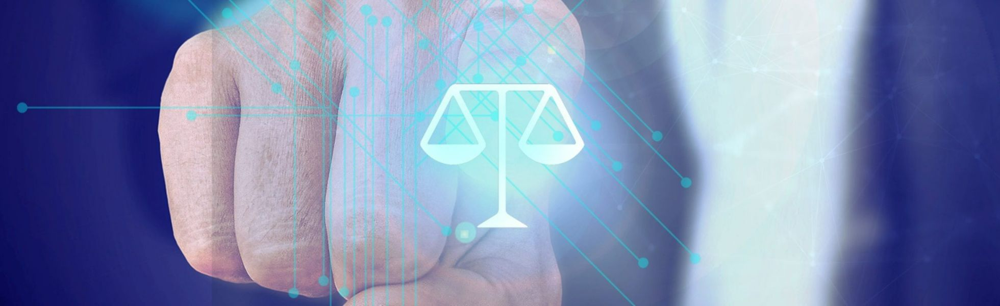
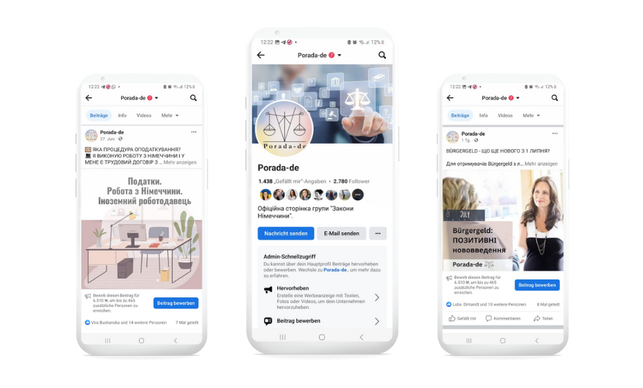

# Porada-de

Porada-de is a site that provides information about the project “Porada-de” for Ukrainians in Germany. This project is an existing project that started at the end of July 2022. The site will be targeted toward refugees and migrants who are looking for advice about the German legal and bureaucratic system. This site will be useful for those who want to join the team, collaborate, or donate. The project exists as a Facebook page, where the posts are published weekly and then discussed in our [Facebook community](https://www.facebook.com/groups/642363020399443) (group). The group has over 37 thousand members. The group grows dynamically and needs urgently more people to advise and write posts. That is why the main aim is to attract people who want to contribute to the project and, therefore, to the community.

This site can be accessed by this [link.](https://zhannamatuzak.github.io/porada-de/index.html)

## User Flow

### Users

1. Person, who wants to find information about the project.
2. Person, who wants to find out who the members of the team are.
3. Person, who wants to join the team or to cooperate.
4. Person, who wants to donate.

### Goals

1. As a visitor, I want to find information about the project to learn about the project's focus and its outcomes.
2. As a visitor, I want to find out who the members of the team are to get in contact with them.
3. As a visitor, I want to join the team or collaborate because I want to be useful for the Ukrainian community.
4. As a visitor, I look for the opportunity to support the project financially via donations to make useful content for the refugees and Ukrainian migrants.

### Task flows

1. User is on the landing page 🠊 sees the main image 🠊 scrolls down 🠊 sees the project description subsection 🠊 reads the information about the project 🠊 clicks on the link, which takes the user to the organization [Soliduarity e.V.](https://www.soliduarity.org/) 🠊 surfs of the website and comes back to [Porada-de](https://www.facebook.com/PoradaDE) page 🠊 scrolls further down 🠊 lands on the topic lists subsection 🠊 sees six most discussed topics on Facebook page [Porada-de](https://www.facebook.com/PoradaDE) 🠊 sees the footer with four social media links 🠊 clicks on the link the user wants 🠊 comes back to the page 🠊 clicks on the button Scroll on Top.

If the user decides not to click on the social links, he presses the Scroll on Top button.

2. User goes to the navigation bar 🠊 and clicks on the About Us link🠊 lands on the About Us page 🠊 sees the photo of the first co-founder, personal information as name and city 🠊 sees the Facebook button 🠊 clicks on it 🠊 lands on the Facebook profile of the first founder 🠊 surfs there and comes back 🠊 sees the photo of the second founder, personal information as name and city 🠊 sees the Facebook button 🠊 clicks on it 🠊 lands on the Facebook profile of the second founder 🠊 surfs there and comes back to the About Us page.

If the user decides not to click on the Facebook button, he scrolls down to the end of the page and clicks on the button Scroll on Top. 

3. User goes to the navigation bar 🠊 and clicks on Contact 🠊 sees the contact form 🠊 reads the question 🠊 decides if the user wants to join the team or to collaborate 🠊 fills in the form 🠊 clicks on Submit button 🠊 sees the Response page with the Tick image and the text "Thank You!" 🠊 in 10 seconds after submission the main page pops up.

If the user decides not to fill in the form, he leaves the page/website or surfs further on the website or clicks on the social media links.

4. User goes to the navigation bar 🠊 and clicks on the button [Donate](https://www.soliduarity.org/donate/) 🠊 lands on the Donate page of organization Soliduarity.e.V. 🠊 sees the information on how to donate 🠊 makes the decision how to pay 🠊 clicks on Donate button under PayPal method or Card method 🠊 is redirected to PayPal app or sees the form for the card payment method 🠊 fills in the information 🠊 transfers the money 🠊 sees the response page 🠊 stay and surfs on the organization website or comes back to Porada-de website.

## Features 

### Existing Features

- __Navigation Bar and Logo__

* Navigation bar and Logo are positioned at the top of the page and placed in the header.
* Logo of the project is on the left side of the header. It is the word Porada-de which begins with the capital letter and then contains the lowercase letters. There is a scales symbol as well shown on the favicon. The scales symbol is a part of the logo. It is not to see in the header for design reasons. The main reason is that the scales are already on the main image on Home page. This idea is borrowed from the Code Institute website.
* Navigation bar is on the right side of the header. It contains navigation links. These are:
  * Home - leads to the Home page, where users can learn about the project Porada-de.
  * About Us - leads to the About page, where users can find information about the founders.    
  * Contact - leads to the contact form page, where users can fill out the form to become a part of a team or to collaborate.
  * Donate - leads to the Donation page of our organization [Soliduarity e. V..](https://www.soliduarity.org/donate/). The Donate link has a heart icon and is designed like a button so the visitor understands that the link has an additional donate function.
* The links have a hover effect. The color of the hover is the brand color of our project which is Clam Shell.
* The navigation is clear and easy to understand for the user.

* The navigation bar and Logo are responsive:
  * On tablet screens: navigation bar and logo organize a column, where all elements are centered.

  * On mobile devices screens, navigation bar and logo look the same as on the tablet screens.

- __The Landing Page (Main image) image__

* The Main image represents the focus of the project which is the legal and bureaucratic system. The scales on it are a part of our logo. The members of our community recognize it because its design is very similar to the cover image of the Facebook page of the project.

- __Project Ethos Section__

* The Project Ethos section will allow the user to learn about the project and its spectrum of topics. This should encourage the user to consider joining our Facebook community and help the members with advice. It has a link to the project's Organization.
* It consists of two subsections: the project description and the topics list subsections.

- __Video Project Section__

* The Video Project Section contains eight videos that are made by the team. This section will allow the user to see exactly what kinds of topics are covered on the videos.
* This section will be updated as the new videos come in the course of time to keep the user up to date.

- Is also has a button Scross on Top that directs to the beginning of Home page.
​

- __The Footer__ 

    * The Footer section includes four links to the relevant social media sites for Porada-de. The Facebook and Youtube links are existing links to the project. The links will open to a new tab to allow easy navigation for the user.
    * The footer is valuable to the user as it encourages them to keep connected via social media.

- __Team Information Section__ 

* The Team Information Section will provide the user with information about the project's founders: their names and links to their Facebook profiles.
This section is useful to the user as they will be able to easily contact the founders only by clicking on the Facebook button.

- __Contact Form__ 

### Features Left to Implement

- The About page will be improved by adding photos and personal information of all team members. The team members are already asked to prepare photos and descriptions about themselves. As the page About Us has the aim to attract the new team members, it should be more appealing and contain personal information and the information of all team members.

- The form on Contact page will be improved as well. It should be added one more box with a dropdown list with predefined topic options. The reason for this is to give options for possible decisions: to “join", “to collaborate”, “to ask a general question”, “to ask a specific question”. It is not integrated yet because it is not discussed with all team members.

- Also the Facebook Community page should be added. It could be very useful because the [Facebook community](https://www.facebook.com/groups/642363020399443) is closed and to become a member the person has to meet certain criteria. 

## Technologies and Tools Used

- [HTML](https://developer.mozilla.org/en-US/docs/Web/HTML) was used as the foundation of the site.
- [CSS](https://developer.mozilla.org/en-US/docs/Web/css) - was used to add the styles and layout of the site.
- [CSS Flexbox](https://developer.mozilla.org/en-US/docs/Learn/CSS/CSS_layout/Flexbox) - was used to arrange items on the pages and to make them responsive.
- [Balsamiq](https://balsamiq.com/) was used to make wireframes for the website.
- [VSCode](https://code.visualstudio.com/) was used as the main tool to write and edit code.
- [Git](https://git-scm.com/) was used for the version control of the website.
- [GitHub](https://github.com/) was used to host the code of the website.
- [Birme](https://www.birme.net/) was used to resize Main image on the landing page.
- [Square my Image](https://squaremyimage.com/) was used to resize co-founder images to a square on the About page.
- [Square my Image](https://www.iloveimg.com/) and [Canva](https://www.canva.com/) was used to adopt images for README.md file.
- [WenMart](https://www.webmart.de/) was used to find a second suitable color to my already picked color.

## Design

* The Design of this website is based on the design of the Facebook page of the project [Porada-de.](https://www.facebook.com/PoradaDE)

### Color

- The two colors were used to design this website. The reason is that it is recommended for non-designers to use no more than two colors.

- Clam Shell color was used to hoover navigation bar links,social media links and scroll on top button, as a background for project Description subsection, form section, and Response section.

- Shamrock color was used to design header, footer, background of topic list subsection, and Submit button.

The usage of two colors could be boring for some visitors and they could leave the website. In order to keep up the user motivation and to improve use experiences, the modest background pattern was used.

The Subtle Gradient Pattern Background for the main was used from the [freefrontend](https://freefrontend.com/css-background-patterns/). 
The code is to find [here](https://codepen.io/chris22smith/pen/pGNVwZ) 

### Typography

### Wireframes

#### Mobile devices

#### Tablets

#### Desktop

## Testing

### Validator Testing 

### Manual testing

### Accessibility and performance 

### Fixed Bugs

### Unfixed Bugs

## Deployment

## Local Deployment

## Credits 

### Content 

### Media

## Other General Project Advice
